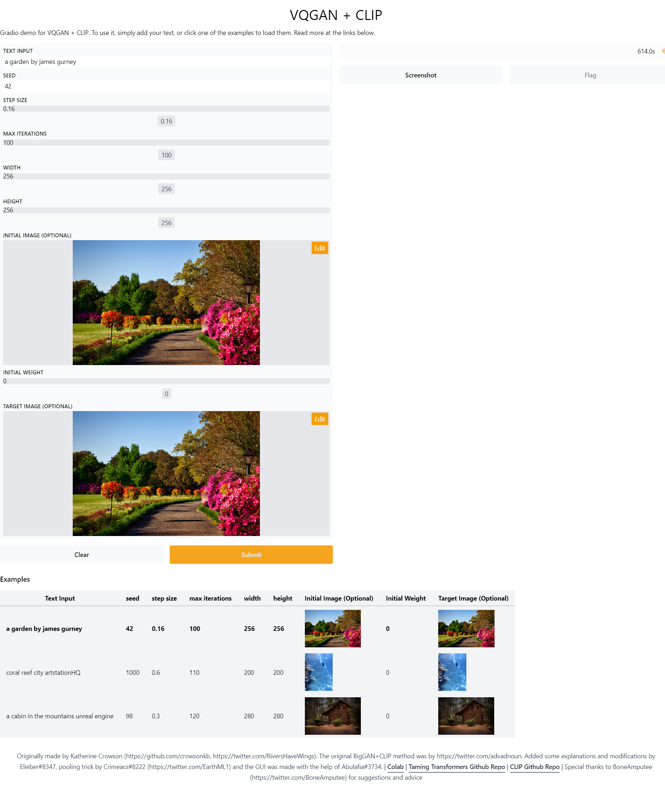

## Brief intro

VQGAN-CLIP has been in vogue for generating art using deep learning. Searching the `r/deepdream` subreddit for VQGAN-CLIP yields [quite a number of results](https://www.reddit.com/r/deepdream/search?q=vqgan+clip&restrict_sr=on). Basically, [VQGAN](https://github.com/CompVis/taming-transformers) can generate pretty high fidelity images, while [CLIP](https://github.com/openai/CLIP) can produce relevant captions for images. Combined, VQGAN-CLIP can take prompts from human input, and iterate to generate images that fit the prompts.

Huge Thanks to the creators for sharing detailed explained notebooks on Google Colab, the VQGAN-CLIP technique has been very popular even among the arts communities.

Originally made by [Katherine Crowson](https://github.com/crowsonkb). The original BigGAN+CLIP method was by [advadnoun](https://twitter.com/advadnoun).Special thanks to [Ahsen Khaliq](https://huggingface.co/akhaliq) for gradeio code.

The original colab Notebook [Link](https://colab.research.google.com/drive/1ZAus_gn2RhTZWzOWUpPERNC0Q8OhZRTZ)

[Taming Transformers Github Repo](https://github.com/CompVis/taming-transformers) and [CLIP Github Repo](https://github.com/openai/CLIP)

This simple Gradeio app for generating VQGAN-CLIP images on a local environment. Screenshot of the UI as below:

## Setup 

The steps for setup are based on the Colab referenced above.

1. Git clone this repo. `git clone https://github.com/krishnakaushik25/VQGAN-CLIP`
2. After that, `cd` into the repo and run: `pip install gradio` for [gradeio](https://gradio.app/getting_started) istallation.
3. Install the required Python libraries.Run `pip install -r requirements.txt`
4. And then Run `python app.py`
5. Wait for few minutes till it executes and then it shows it is running on localhost ann open it in a browser on http://localhost:7860
6. You can select any exampples listed in the app, and enter the text and parameters of your choice, it can take 30 min - 1 hour time for some examples ig the the model training steps are more.

**How many steps to run VQGAN-CLIP?**
There is no ground rule on how many steps to run to get a good image. Images generated are also not guaranteed to be interesting. Experiment! 

Less training steps can produce some images which can be very bad.

`app_file`: Path to your main application file (which contains either `gradio` or `streamlit` Python code).  
The path file is app.py which is based on gradio.
